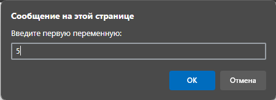
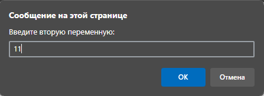
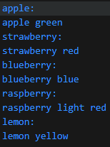
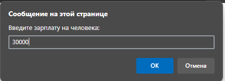

# Рефакторинг кода

## Отчет по Лаб. №7


------------

### Задание 1: level stone:
**Скрипт сравнивает две переменные и выводит равны они или нет.**
```js
let letOne = prompt('Введите первую переменную:');
let letTwo = prompt('Введите вторую переменную:');

if (letOne === letTwo) {
    console.log('Переменные равны.');
} else {
    console.log('Переменные не равны.');
}

letOne += 'world';
```
#### Вывод задания 1:





### Задание 2: level iron:
**Скрипт выводит названия фруктов, а затем отображает название фрукта и его цвет.**
```js
let fruits = ["apple", "strawberry", "blueberry", "raspberry", "lemon"];
    
for (let i = 0; i < fruits.length; i++) {
    console.log(fruits[i] + ":");
    switch (fruits[i]) {
        case "apple":
            console.log(fruits[i] + " " + "green");
            break;
        case "strawberry":
            console.log(fruits[i] + " " + "red");
            break;
        case "blueberry":
            console.log(fruits[i] + " " + "blue");
            break;
        case "raspberry":
            console.log(fruits[i] + " " + "light red");
            break;
        case "lemon":
            console.log(fruits[i] + " " + "yellow");
            break;
        default:
            throw new Error("No such color.")
    }
}
```
#### Вывод задания 2:



### Задание 3: level gold:
**Скрипт выполняет подсчет затрат на зарплату сотрудникам.
Где спрашивает у пользователя кол-во сотрудников и зарплату на одного человека.**
```js
let employeesAmount = undefined;
while(employeesAmount === undefined) {
    let input = prompt('Введите количество человек:', undefined);
    if (!isNaN(parseFloat(input))) {
        employeesAmount = parseFloat(input);  
    }
}

let salary = undefined;
while(salary === undefined) {
    let input = prompt('Введите зарплату на человека:', undefined);
    if (!isNaN(parseFloat(input))) {
        salary = parseFloat(input);
    }
}

alert('Затраты на ЗП: ' + employeesAmount * salary);
```

#### Вывод задания 3:





### Задание 4:
**Скрипт проводит анализ имеющихся студентов в массиве. Выводит среднюю оценку и список плохих студентов.**
```js
let students = [
    { FIO: 'Петров А.А.', grade: 5 },
    { FIO: 'Иванов Б.Б.', grade: 3.4 },
    { FIO: 'Сидоров Г.Г.', grade: 9 },
    { FIO: 'Смирнов Д.Д', grade: 2 },
    { FIO: 'Молодой Е.Е', grade: 3.4 }
];

let sum = 0;
let count = 0;
let poorStudents = [];

for (let i = 0; i < students.length; i++) {
    let student = students[i];
    let grade = student.grade;

    if (grade < 0 || grade > 5) {
        console.log('Оценка для студента ' + student.FIO + ' не учитывается, так как она не соответствует допустимым значениям.');
        continue;
    }

    if (grade < 4) {
        poorStudents.push(student);
    }

    sum += grade;
    count++;
}

if (count > 0) {
    let averageGrade = sum / count;
    console.log('Средняя оценка: ' + averageGrade);
} else {
    console.log('Нет оценок для учета.');
}

console.log('Плохие студенты:');
if (poorStudents.length === 0) {
    console.log('Таких нет.');
} else {
    poorStudents.forEach(function (student) {
        console.log('ФИО: ' + student.FIO + '; Оценка: ' + student.grade);
    });
}
```
#### Вывод задания 4:


